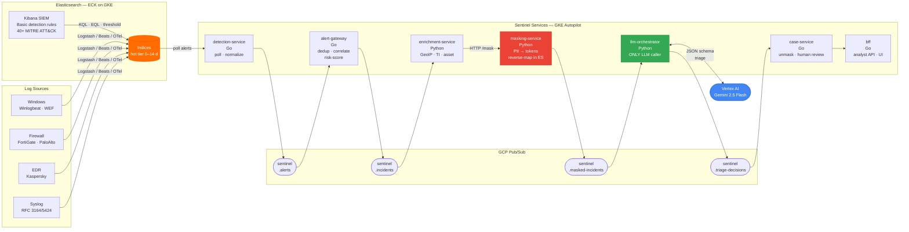
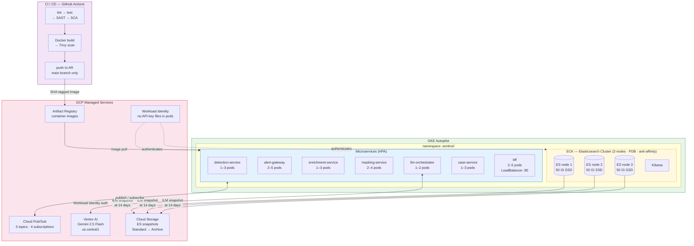

# vigil — AI-Assisted SOC/NOC Platform

An open-source, AI-assisted Security & Network Operations platform built on the **free/Basic-licensed Elastic Stack**. Sentinel ingests telemetry, detects threats with Elastic SIEM detection rules (MITRE ATT&CK mapped), correlates alerts into incidents, and uses **Gemini 2.5 Flash via Vertex AI** as a triage assistant — never as an autonomous decision-maker.

> **Working language of the entire system, code, comments, logs, prompts, and UI: English.**

---

## Architecture

### Alert-to-Decision Pipeline



### GCP Deployment Architecture



**Core principles (see [CLAUDE.md](CLAUDE.md)):**

- **Deterministic core, LLM as ranker.** Rule-based logic decides; LLM only enriches and suggests.
- **LLM triggered per incident** — never per alert or per log. Cuts LLM request count by 10–50×.
- **All LLM input is masked** (no PII), all output is validated JSON, all calls are audit-logged.
- **Only `masking-service`** holds plaintext PII reverse-maps (stored in Elasticsearch — multi-replica safe).
- **Only `llm-orchestrator`** calls the LLM API.

---

## Services

| Service | Language | Responsibility |
| --- | --- | --- |
| `detection-service` | Go | Reads ES alerts, normalizes, publishes to Pub/Sub |
| `alert-gateway` | Go | Dedup, correlation, risk scoring; forms incidents |
| `enrichment-service` | Python | GeoIP, threat-intel, asset criticality enrichment |
| `masking-service` | Python | PII pseudonymization + reverse-map HTTP API |
| `llm-orchestrator` | Python | LLM triage with provider interface (Vertex AI / mock) |
| `case-service` | Go | Unmasks, manages cases, human-review queue |
| `bff` | Go | Thin HTTP API for analyst triage UI |

---

## Quick Start (local dev)

**Prerequisites:** Docker, Docker Compose, `make`, `curl`

```bash
# 1. Clone and enter
git clone https://github.com/yusufarbc/Vigil.git && cd Vigil

# 2. Copy env file (defaults work for local dev)
cp .env.example .env

# 3. Start everything
make up

# 4. Bootstrap Pub/Sub topics (run once after first start)
make pubsub-init

# Kibana:  http://localhost:5601
# BFF:     http://localhost:8080/healthz
```

> **LLM is mocked by default** (`LLM_PROVIDER=mock`). No Vertex AI credentials needed for local dev. The mock returns valid, schema-conformant triage decisions.

---

## CI / CD

Two-branch flow (ADR-011):

```text
feature branch
      │
      ▼ PR
   test ──► lint → test → SAST/SCA → Docker build → Trivy scan
      │
      ▼ PR (requires green pipeline on test)
   main ──► same gates → push images to Artifact Registry
```

GitHub secrets required for image push (`main` only):

| Secret | Value |
| --- | --- |
| `GCP_PROJECT` | GCP project ID |
| `WIF_PROVIDER` | Workload Identity Federation provider resource name |
| `WIF_SERVICE_ACCOUNT` | GSA email with `roles/artifactregistry.writer` |

---

## Infrastructure

```text
infrastructure/
├── k8s/
│   ├── namespace.yaml           # sentinel namespace (apply first)
│   ├── eck/                     # ECK: 3-node ES cluster, Kibana, ILM, GCS snapshot repo
│   └── services/                # K8s manifests for all 7 microservices + shared ConfigMap
├── config/
│   ├── detection-rules/         # 40+ MITRE ATT&CK-mapped SIEM rules (KQL + EQL)
│   ├── logstash/                # Pipelines: FortiGate, Kaspersky, PaloAlto, Windows WEF, Syslog
│   ├── elasticsearch/           # elasticsearch.yml
│   ├── kibana/                  # kibana.yml
│   └── elastic/                 # Fleet policy templates
├── client-configs/              # Windows GPO: Winlogbeat, Metricbeat, Heartbeat, Sysmon
└── scripts/                     # ELK bare-metal setup (Ubuntu Jammy), Sysmon installer
```

### Ingestion sources

| Source | Pipeline |
| --- | --- |
| Windows Event Logs (Winlogbeat / WEF) | `windows_wef.conf` |
| Syslog (RFC3164 / RFC5424) | `syslog.conf` |
| Palo Alto firewall | `paloalto.conf`, `paloalto_syslog.conf` |
| FortiGate firewall | `fortigate.conf` |
| Kaspersky EDR | `kaspersky.conf` |
| Libraesva email gateway | `libraesva.conf` |

### Detection rules

40+ MITRE ATT&CK-mapped rules in [`infrastructure/config/detection-rules/siem.rules.yml`](infrastructure/config/detection-rules/siem.rules.yml), covering:
Initial Access · Execution · Credential Access · Persistence · Lateral Movement · Defense Evasion · Firewall anomalies.

---

## Development

```bash
make test       # go test -race + pytest for all services
make lint       # golangci-lint + ruff for all services
make build      # docker compose build
```

```bash
# Individual Go service
cd services/detection-service && go test ./... -race

# Individual Python service
cd services/masking-service
pip install -e ".[dev]"
pytest tests/ -v
```

---

## Production Deploy (GKE)

```bash
# Apply all K8s manifests in order
GCP_PROJECT=your-project IMAGE_TAG=abc1234 make apply-k8s

# Or manually step by step:
kubectl apply -f infrastructure/k8s/namespace.yaml
kubectl apply -f infrastructure/k8s/eck/
envsubst < infrastructure/k8s/services/configmap.yaml | kubectl apply -f -
# ... then each service manifest
```

**Credentials:** Workload Identity — no API key files in pods (ADR-006).  
**LLM:** Set `LLM_PROVIDER=vertex` and `GCP_PROJECT=<your-project>` (already set in the llm-orchestrator manifest).

---

## Architecture Decisions

Full log in [DECISIONS.md](DECISIONS.md). Key decisions:

| ADR | Decision |
| --- | --- |
| ADR-001 | LLM per incident, never per alert |
| ADR-004 | Mandatory PII masking before LLM |
| ADR-005 | Gemini 2.5 Flash (Vertex AI) · Claude Haiku 4.5 fallback |
| ADR-008 | Self-hosted Elasticsearch via ECK (not Elastic Cloud) |
| ADR-012 | Go (operational) + Python (AI/enrichment) |
| ADR-013 | GCP Pub/Sub (not Kafka) |
| ADR-014 | Elastic Basic-tier audit: ELSER / risk scoring / ML jobs blocked |
| ADR-015 | masking-service reverse-map stored in Elasticsearch (multi-replica safe) |
| ADR-016 | GKE Autopilot · `node.store.allow_mmap=false` for Autopilot compatibility |

---

## License

[MIT](LICENSE)
